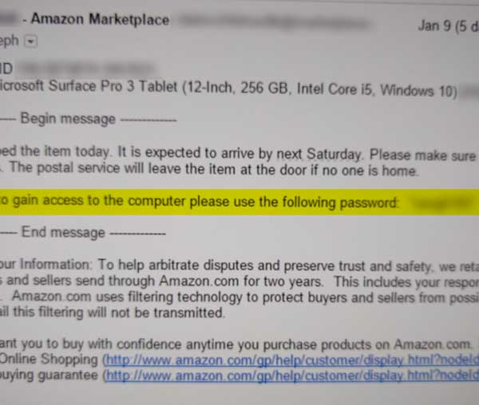
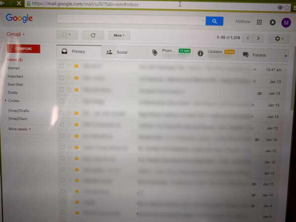

# How a stranger let me into his email

I bought a used Surface Pro 3 last week. Normally when you sell a device you factory reset it, and send it in the freshly wiped state. Windows 10 even has a factory reset that repeatedly over-writes the whole drive to fully remove all traces of your files.

<figure>

<figcaption>
This is not the generally though of as a "good" way of transferring ownership of a computer.
</figcaption>
</figure>

Not this silly, gentle, trusting soul. Instead, he sent it to me with his account still set up. Then he emailed me his password. **I shit you not.**

I thought, OK, this is goofy, but whatever. *Certainly* he at least deleted his account, and created a new empty one to pass off to the device's new owner. There's no way he left it **signed in to his Google account.**

<figure>

<figcaption>
This is not my email account.
</figcaption>
</figure>

So I sign in, and ... Not only is the thing still signed in to his Gmail account, but he has Chrome sync signed in too. I can see what he's been doing on his computer at home while this one was in the mail! Turns out he likes pictures of Transformers and watches a lot of Netflix. But I digress.

I think he didn't wipe it because there was something borked in the recovery partition. I wasn't planning on using that anyway though. A fresh install -- nuking it from orbit -- is the only way to be sure (sure enough for my purposes anyway).

## PSA: Wipe your devices!

If you're selling a device, *please, please, please* wipe it first. If this guy had sent it to a less kindly person he could have wound up trolled *so badly* -- if he was lucky. He dodged a bullet selling it to somebody like me.

The rest of you, don't do that.
