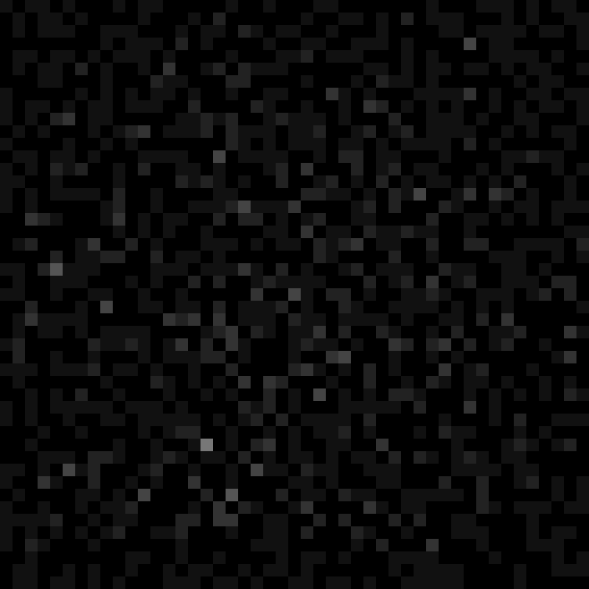

#JS Sandpile Model

These models work by dropping "grains" on random spots on the grid. They stack up, and once a spot has 4 grains it "collapses" and distributes its 4 grains to its cardinal neighbors.

One very interesting property of this particular model is that it will always wind up the same given a certain starting state, regardless of what order you simulate the individual spots in. As long as you hit all of them until all of them have been hit without anything happening, the result will be the same no matter how you go about deciding how to order your simulation steps.

See http://en.wikipedia.org/wiki/Abelian_sandpile_model

<canvas id="sandpile"  height="640" width="640" style="max-width:100%;"></canvas>

